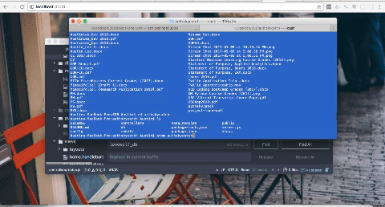
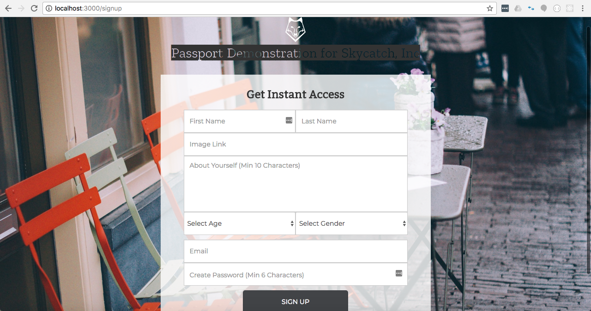

# authskycatch | The Login to Rule Them All!

A sweet application that demonstrates login with Passport, Sequelize and mySQL.

authskycatch => is a basic JavaScript web application that demonstrates the basic functionality of authentication with Passport and data storage with Sequelize/SQL using saved user inputs. This application will also use survey logic to match you with the best person for future activities and plans, once a member.

## Here is a quick demo of authskycatch:

## Here is the Heroku deployment link:
https://stark-waters-35672.herokuapp.com/

## Major Tools, Features or Methods Used:
Prevalent packages such as Passport, Sequelize, bcrypt, Express and mySQL were used to save, grab and encrypt data input by users via login/logout features. The information was received from initial users in the signup.handlebars options page after the first sign up button on landing page {landing.handlebars} was rendered and clicked. When users are finished entering initial information, they submit this data by clicking the bottom submit button. This will first validate their input for correct syntax, then send the user data input to be stored in our database models using mySQL and Sequelize through routes.js in controllers. Once initial functionality with the saved user has been committed to our database, the user can now login, use our matching features, and logout of their account. When logging in with their saved data, the user will have their emails and passwords validated first, then authenticated by the Passport and bcrypt packages. If their input matches any saved information in our databases, they will be logged in, and move from the login page {login.handlebars} to the inner home page {home.handlebars}, where they can take our survey and use the app features and logout as well once finished with their session. If their input has no match from sign in within the outer layer of the application, they will remain on the landing page {landing.handlebars} until they fill out the survey correctly specified in signup.handlebars to establish their respective accounts.

## authskycatch Relevant Page Images:
* This login page for login.handlebars will send user information for authentication and comparison to existing information in the database once submitted:
! [alt text](./public/assets/images/signin.png)

* This sign up page for signup.handlebars will collect new user information and validate the input before sending it to our database for saving, and later authenticating when the user logs out and logs back in using their former credentials:

## Worth Noting & Issues Faced/Challenges Fixed:
Aside from using the Passport package with bcrypt to provide authentication services, I initially ran into issues trying to connect the database and mySQL to our packages. This was fixed by requiring and noting different dependencies in our server.js file. I also had to double check the routes used to make sure the correct elements were received and/or posted. A few syntax errors in SQL were also clipped during debugging to ensure a successful deployment.

# Enjoy!  
